🛒 Shopping Customer App (Jetpack Compose)

A modern Android E-commerce application built using Jetpack Compose, Kotlin, Firebase, and Koin DI.
The app delivers a complete shopping experience with real-time updates, wishlist, cart, order placement & cancellation, live address saving, dark/light theme support, and Firebase Authentication.

   
✨ Key Highlights
  * 🌗 Light & Dark Theme support
  * 🧩 100% Jetpack Compose UI (No XML)
  * 🔥 Firebase Realtime Backend
  * 🧠 Single ViewModel + UseCase pattern
  * 💉 Koin Dependency Injection
  * 🧭 Compose Navigation with nested graphs
  * 📦 Realtime cart, wishlist & order updates
  * ❌ Order cancellation feature

📱 Features

  🔐 Authentication
    * Firebase Email/Password login & signup
    * Auto session handling
    * Auth-based navigation flow
    * Secure sign-out handling

  🏠 Home Screen
    * Category listing (LazyRow)
    * Auto-scroll banners
    * Featured products
    * Real-time product updates
    * Search with live results
    * Loading & error UI states

  🔍 Search
    * Real-time product search
    * Loading / error / empty states
    * Navigate directly to product detail

  🛍️ Products
    * Product listing
    * Product details screen
    * Category-wise product filtering
    * Search-based results

  ❤️ Wishlist
    * Add/remove products
    * Firebase realtime sync
    * Persistent per user

  🛒 Cart
    * Add to cart
    * Quantity handling
    * Buy from cart
    * Realtime cart updates

  📦 Orders
    * Place orders
    * User-specific order history
    * Realtime order status tracking
    * ❌ Cancel order feature (User side)

  📍 Address Management
    * Save live GPS location as delivery address
    * Edit/update address
    * Address stored in Firebase

  👤 Profile
    *User profile screen
    * Orders navigation
    * Address management
    * Logout

## 📸 Screenshots

| LogIn | SginUp | Home | Search | AllProductScreen |   
|-----|------------|--------|------------|--------|
| 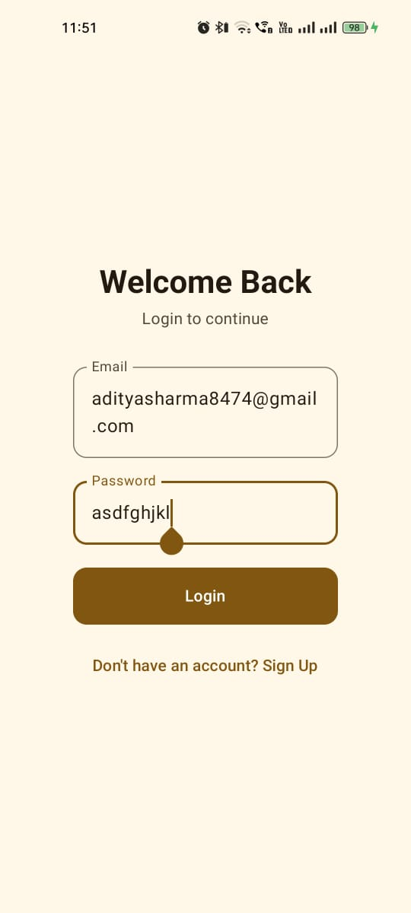 | 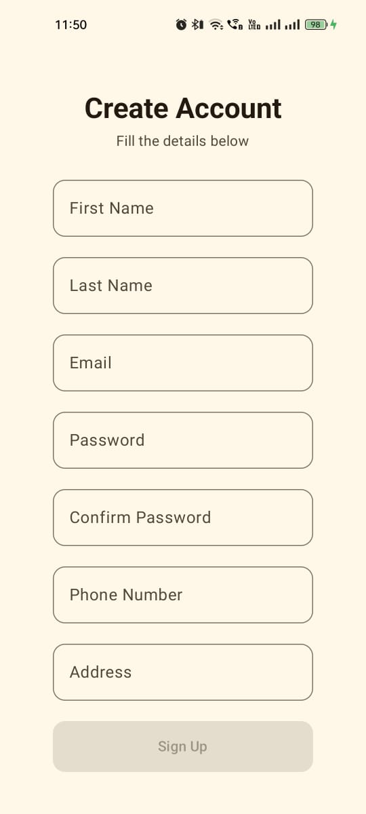 | 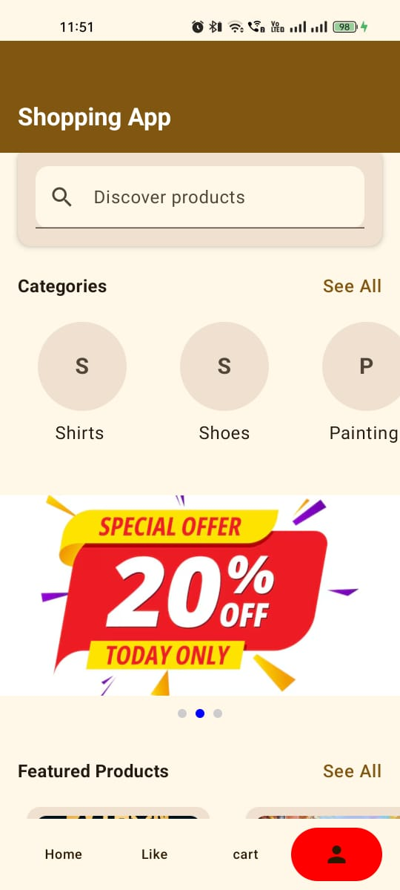 | 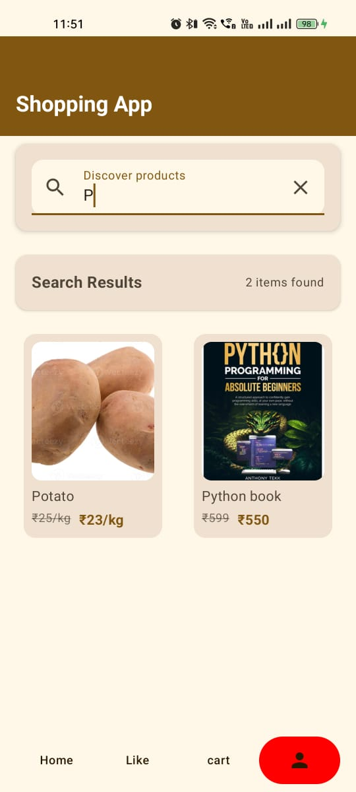 | 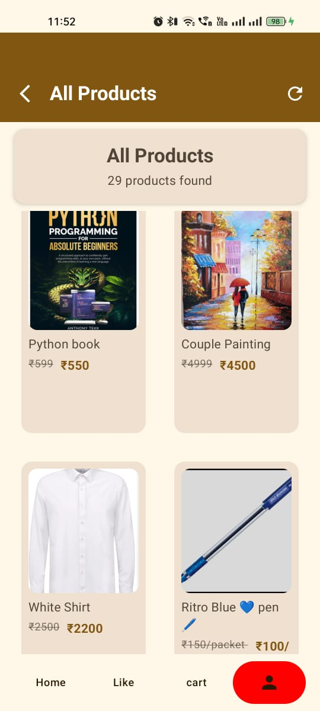 |

| AllCategoriesScreen | ProductDetails | CheckOutScreen | CheckOutDetails | PickLiveLocationScreen |   
|-----|------------|--------|------------|--------|
| 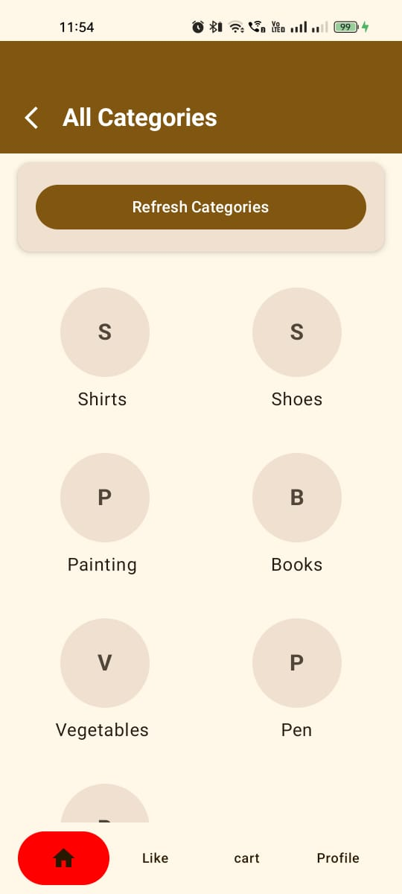 | 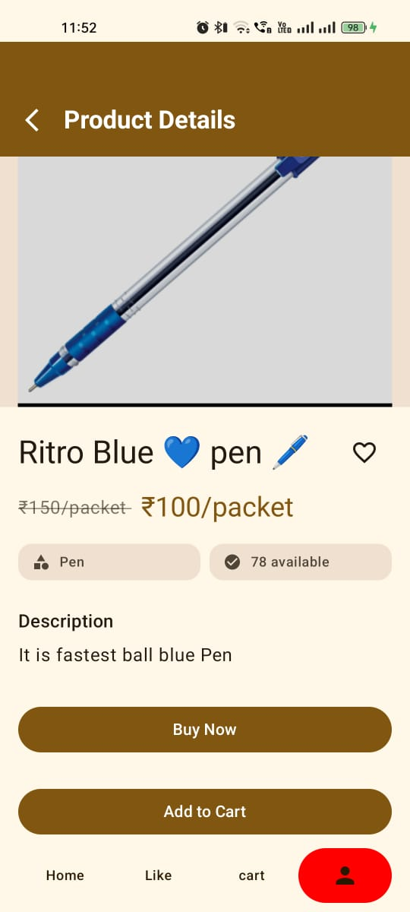 | 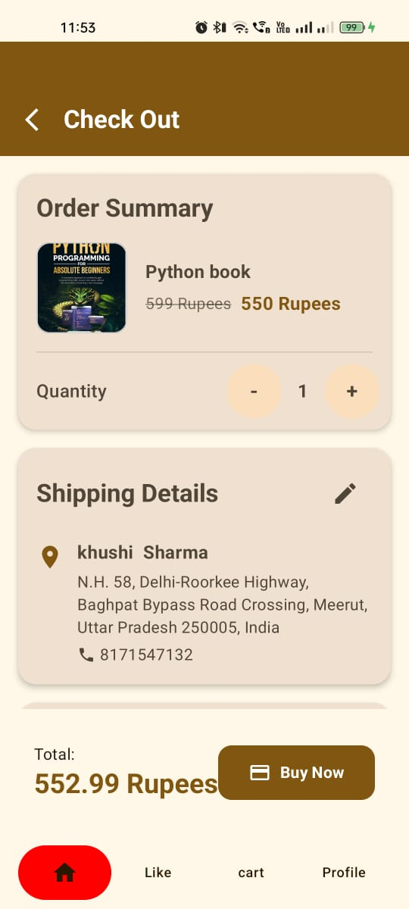 | 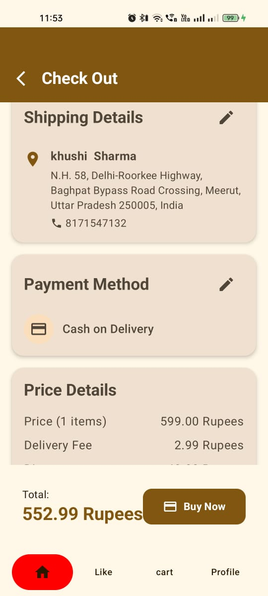 | 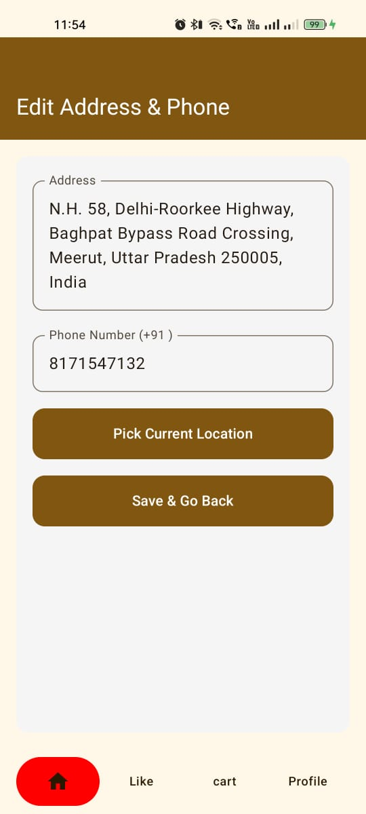 |

| WishListScreen | CartScreen | EmptyCart | CheckOutDetails | CustomerProfileScreen |   
|-----|------------|--------|------------|--------|
| 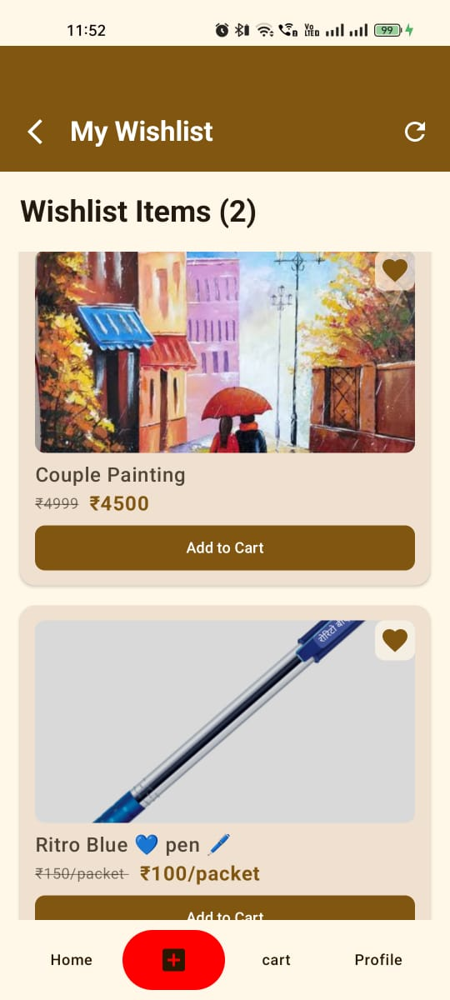 | 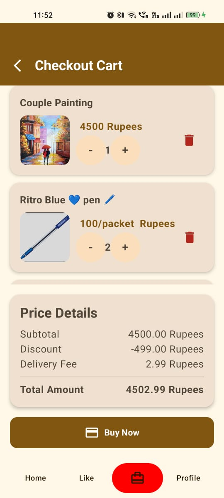 | 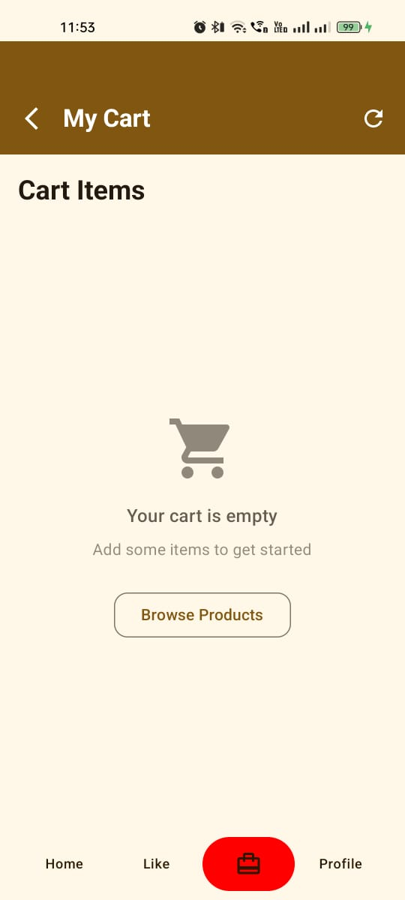 |  | 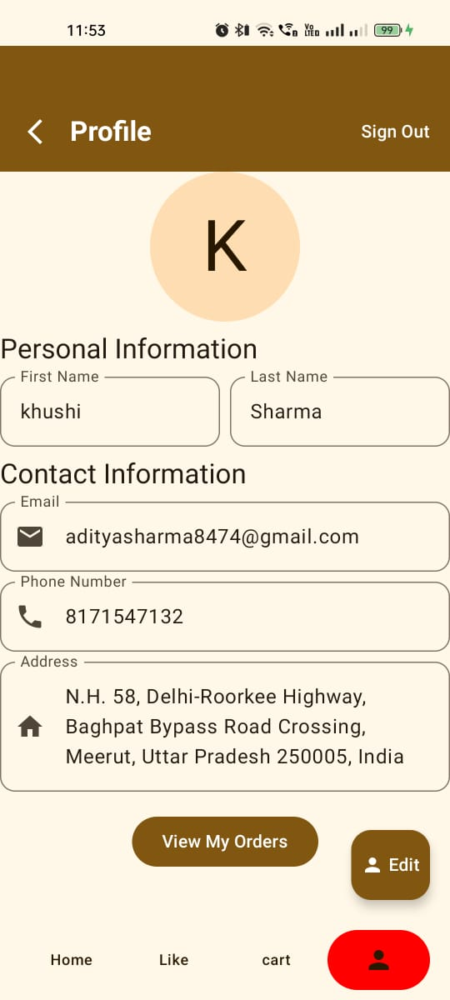 |

| MyOrdersScreen | SignOut| 
|------------|--------|
| 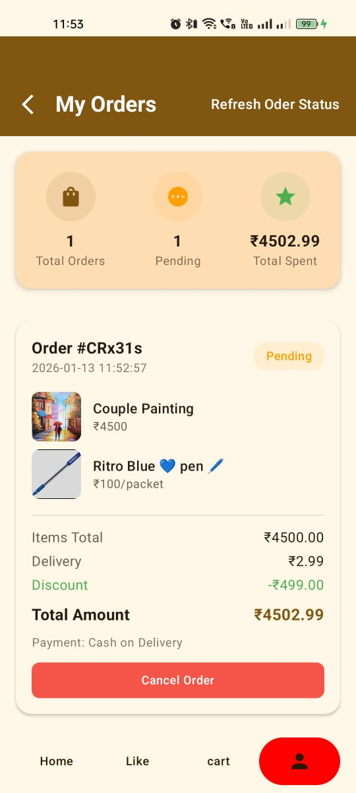 | 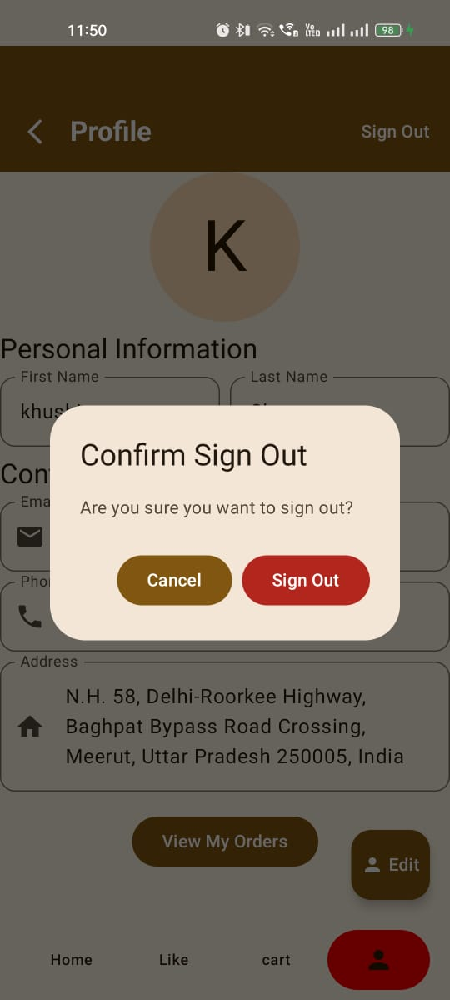 | 

🧭 Navigation Architecture
  * Jetpack Compose Navigation
  * Nested navigation graphs
  * Auth flow separated from main flow
  * Bottom navigation synced with routes
  * Animated Bottom Bar

  Auth Graph
    ├── Login
    └── SignUp

  Home Graph
     ├── Home
     ├── Categories
     ├── Products
     ├── Product Details
     ├── Cart
     ├── Wishlist
     ├── Orders
     ├── Address
     └── Profile

🏗 Architecture
  The app follows a clean & scalable structure:

  UI (Jetpack Compose)
     ↓
  ViewModel (Single ViewModel)
     ↓
  UseCases
     ↓
  Firebase Repository

✅ Why Single ViewModel?
  * Centralized state management
  * Simplified Firebase listeners
  * Easier realtime sync handling

💉 Dependency Injection (Koin)
  # Koin used for:
    * ViewModel injection
    * Firebase services
    * UseCases

  # Clean & lightweight DI setup

## 🔗 Related Admin App

This Customer App works alongside a dedicated **Shopping Admin App** used to manage products, categories, banners, and orders.

- Admins upload product & banner images via **Supabase Storage**
- Image URLs are stored in **Firebase Realtime Database**
- This app fetches all data from Firebase and displays it to users
- The Customer App does **not** connect directly to Supabase

🔗 Admin App Repository:  
https://github.com/adityasharma455/shopping-admin-app

   
🔥 Firebase Usage

🔑 Authentication
   * Firebase Auth (Email/Password)

📦 Database Structure (Constants Used)
      const val USER_PATH = "users"
      const val CATEGORY_PATH = "Categories"
      const val PRODUCT_PATH = "Products"
      const val ADD_TO_WISH_LIST = "Add_To_WishList"
      const val Add_TO_CART = "Add_To_Cart"
      const val BANNER_MODEL = "BannerModel"
      const val USER_FCM_TOKEN = "user_Fcm_Token"
      const val ORDERS_PATH = "Orders"
      const val USER_ORDERS_SUBCOLLECTION = "UserOrders"

🖼 Image Handling
- Product and banner images are fetched via URLs stored in Firebase Realtime Database
- Images are uploaded and managed by the Admin App using Supabase Storage
- This Customer App does not interact with any storage service directly

🧠 State Handling
  * Loading states
  * Error handling
  * Empty UI states
  * Lifecycle-aware state collection

🛠 Tech Stack

  # Layer -> Technology
   * Language -> Kotlin
   * UI ->	Jetpack Compose
   * Navigation ->	Compose Navigation
   * Architecture ->	MVVM + UseCase
   * DI ->	Koin
   * Backend ->	Firebase
   * Database ->	Firebase Realtime DB
   * Storage -> Firebase Storage

🚀 Setup Instructions

  1. Clone repository
       git clone https://github.com/adityasharma455/shopping-customer-app.git
  2. Open in Android Studio
  3. Add google-services.json in app/
  4. Enable Firebase services:
     * Authentication (Email/Password)
     * Realtime Database
     * Storage
  5. Build & Run 🚀

📌 Future Enhancements
  * Full FCM notification support
  * Payment gateway integration

🔔 FCM Token Registration

  * Generate FCM token after user registration/login
  * Store the token in Firestore under user_Fcm_Token
  * Use token for receiving push notifications from the Admin App
  * Enable future support for real-time product notifications

FCM Flow

  1. User registers or logs in
  2. App fetches Firebase Messaging token
  3. Token is saved in Firestore with user ID
  4. Admin App uses this token to send product notifications

👨‍💻 Author

Aditya Sharma
🎓 3rd Year Computer Science Student
📱 Android Developer | Kotlin | Jetpack Compose | Firebase

🔗 GitHub: https://github.com/adityasharma455
